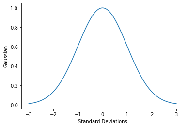

# AeroSplat
Experimenting with splatting methods for aerodynamics analysis

## Gaussian Curve

We define our Guassian curve as a function of variance, which we will represent by the symbol $\sigma^2$.
In this case, $\sigma$ will be referred to as a deviation, however, for our application we will calculate $\sigma^2$ directly.
Evaluated at a single point, this is given by 

$g = e^{-0.5 \sigma^2}$,

and evaluating for a range in $\sigma$ yields the curve below.




## Gaussian Splat

The Gaussian splat will be used to scale the velocity given at the center of the splat for evaluations at some distance away from its center.
It is considered to be a function of the vector $\boldsymbol{r}_i$ representing the position of the $i^{th}$ splat relative to the origin, a second vector $\boldsymbol{r}_k$ for the $k^{th}$ point at which the splat is being evaluated, a vector $\boldsymbol{q}_i$ representing the orientation of the splat, and a vector $\boldsymbol{s}_i$ representing the scaling of the splat with respect to its principal axes.
We'll consider the combined vector $\boldsymbol{x}_i = \left( \boldsymbol{r}_i, \boldsymbol{q}_i, \boldsymbol{s}_i \right)$ to be the parameters of the splat, which we will use when designating derivatives or integrals taken with respect to the splat's own properties, versus those with respect to the point of evaluation.

### Distance

A distance vector 

```math
\boldsymbol{d}_{ik} = \boldsymbol{r}_k - \boldsymbol{r}_i
```

defines the vector from the center of the $i^{th}$ splat to the $k^{th}$ point of evaluation.
If we define

```math
\boldsymbol{r}_i = x_i \hat{\boldsymbol{i}} + y_i \hat{\boldsymbol{j}} + z_i \hat{\boldsymbol{k}}
```

and 

```math
\boldsymbol{r}_k = x_k  \hat{\boldsymbol{i}} + y_k \hat{\boldsymbol{j}} + z_k \hat{\boldsymbol{k}}
```

with $(\hat{\boldsymbol{i}}, \hat{\boldsymbol{j}}, \hat{\boldsymbol{k}})$ being the basis vectors for the inertial reference frame, then we can see

```math
\boldsymbol{d}_{ik} = (x_k - x_i) \hat{\boldsymbol{i}} + (y_k - y_i) \hat{\boldsymbol{j}} + (z_k - z_i) \hat{\boldsymbol{k}},
```

or, in matrix form,

```math
\boldsymbol{d} = \begin{bmatrix} x_k - x_i \\ y_k - y_i \\ z_k - z_i \end{bmatrix}.
```

This represents the distance in three-dimensional (3D) coordinates, however, we will initially develop our method for evaluation in a two-dimensional (2D) plane, for which we can eliminate the $z$ coordinate, in other words


```math
\boldsymbol{d}_{ik} = (x_k - x_i) \hat{\boldsymbol{i}} + (y_k - y_i) \hat{\boldsymbol{j}},
```

and 

```math
\boldsymbol{d}_{ik} = \begin{bmatrix} x_k - x_i \\ y_k - y_i \end{bmatrix}.
```

When representing the 2D variant of the splatting model in subsequent sections, we will only use the first two rows and/or columns of respective vectors and matrices.


### Orientation

Our splat is given an orientation with respect to the inertial reference frame, which we represent in the form of a rotation matrix $\mathbf{R}$.
For a model in 2D, where the orientation vector $\boldsymbol{q}_i$ is represented by a single angle $\theta$ in radians defined about $\hat{\boldsymbol{k}}$, the rotation matrix

```math
\mathbf{R}_i =
\left[\begin{matrix}\cos{\left(θ \right)} & - \sin{\left(θ \right)}\\\sin{\left(θ \right)} & \cos{\left(θ \right)}\end{matrix}\right].
```

For a model in 3D, where the orientation vector $\boldsymbol{q}= \left( q_w, q_x, q_y, q_z \right)$ contains components of a unit quaternion,

```math
\mathbf{R}_i = 
\left[\begin{matrix}- 2 q_{y}^{2} - 2 q_{z}^{2} + 1 & - 2 q_{w} q_{z} + 2 q_{x} q_{y} & 2 q_{w} q_{y} + 2 q_{x} q_{z}\\2 q_{w} q_{z} + 2 q_{x} q_{y} & - 2 q_{x}^{2} - 2 q_{z}^{2} + 1 & - 2 q_{w} q_{x} + 2 q_{y} q_{z}\\- 2 q_{w} q_{y} + 2 q_{x} q_{z} & 2 q_{w} q_{x} + 2 q_{y} q_{z} & - 2 q_{x}^{2} - 2 q_{y}^{2} + 1\end{matrix}\right].
```

Using either of these matrices, we may express the distance $\boldsymbol{d}_{ik}$ in the rotated frame as 

```math
\boldsymbol{c}_{ik} = \mathbf{R}_i \boldsymbol{d}_{ik},
```

using the $\boldsymbol{c}_{ik}$ to represent the distance vector in the rotated frame for the $k^{th}$ evaluation point relative to the $i^{th}$ splat.


### Scaling

We use the term scaling to represent stretching on shrinking a given splat along each of the principle axes in its rotated reference frame.
This scaled distance is obtained by taking the dot product of a scaling vector $\boldsymbol{s}_i = \left( s_x, s_y, s_z \right)$ times the rotated distance vector, or

```math
\boldsymbol{b}_{ik} = \boldsymbol{s}_i \cdot \mathbf{R}_i \boldsymbol{d}_{ik},
```

using the $\boldsymbol{b}$ to represent the _scaled_ distance vector in the rotated frame.
It is also convenient to write the above expression in matrix notation, or 

```math
\boldsymbol{b}_{ik} = \boldsymbol{s}_i^T \mathbf{R}_i \boldsymbol{d}_{ik},
```

where $(\cdot)^T$ is the matrix or vector transpose.
For example, in the 2D model, we can expand this as

```math
\boldsymbol{b}_{ik} =
\begin{bmatrix} s_x & s_y \end{bmatrix}
\left[\begin{matrix}\cos{\left(θ \right)} & - \sin{\left(θ \right)}\\\sin{\left(θ \right)} & \cos{\left(θ \right)}\end{matrix}\right]
\begin{bmatrix} x^\prime - x \\ y^\prime - y \end{bmatrix}.
```


### Variance and Covariance

Given the equations above for how to position, rotate, and scale an individual splat, we can write the variance

```math
\sigma^2_{ik} = \boldsymbol{b}_{ik} \cdot \boldsymbol{b}_{ik},
```

and thus we may calculate the gaussian $g_{ik}$ as defined above given the splat properties $\boldsymbol{x}_i$ and evaluation location $\boldsymbol{r}_k$ as

```math
g_{ik} = e^{-0.5 \sigma^2_{ik}}.
```

We may also define a covariance matrix for our splat

```math
\mathbf{\Sigma}_i = \mathbf{R}_i^T \boldsymbol{s}_i \boldsymbol{s}_i^T \mathbf{R}_i
```

such that our variance equation becomes

```math
\sigma^2_{ik} = \boldsymbol{d}_{ik}^T \mathbf{\Sigma}_i \boldsymbol{d}_{ik}
```

## Velocity

Having defined the properties of the Gaussian splat above, and assuming that the fluid associated with that splat has a velocity 

```math
\boldsymbol{v}_i = u_i \hat{\boldsymbol{i}} + v_i \hat{\boldsymbol{j}} + w_i \hat{\boldsymbol{k}}
```

at its center position $\boldsymbol{r}_i$, then the velocity of the splat fluid at the evaluation position $\boldsymbol{r}_k$ is

```math
\boldsymbol{v}_{ik} = \boldsymbol{v}_i g_{ik}.
```

Supposing we have several splats, where we will represent the quantity $n$, then we can write the total velocity of all fluid at that point as

```math
\boldsymbol{v}_k = \sum_{i=1}^n \boldsymbol{v}_{i} g_{ik}.
```

### Boundary Error

We will define a boundary condition where the velocity is specified as

```math
\boldsymbol{v}_b = u_b \hat{\boldsymbol{i}} + v_b \hat{\boldsymbol{j}} + w_b \hat{\boldsymbol{k}}
```

using the $b$ subscript to represent an individual boundary, which may exist on either a line or surface.
In general, this will be some fluid source, for which one or more of the terms is non-zero, or a non-slip boundary on an object's surface where are of the terms are zero.
A velocity error vector $\boldsymbol{e}_{bk}$ is defined on the $b^{th}$ boundary for the $k^{th}$ evaluation point,

```math
\boldsymbol{e}_{bk} = \boldsymbol{v}_k - \boldsymbol{v}_b,
```

and there is an associated error variance

```math
\lambda_{bk} = \boldsymbol{e}_{bk} \cdot \boldsymbol{e}_{bk}.
```

As part of defining our loss function for optimizing the properties of our splats, we would intend to integrate our error variance over the boundary line or surface, so our loss at the $b^{th}$ boundary is

```math
L_b = \int_b \lambda_{bk} \textnormal{d} \boldsymbol{b} .
```

In the case of a straight line boundary that is defined by two points, 
```math
\boldsymbol{r}_{0b} = x_{0b} \hat{\boldsymbol{i}} + y_{0b} \hat{\boldsymbol{j}} + z_{0b} \hat{\boldsymbol{k}},
```
and 
```math
\boldsymbol{r}_{1b} = x_{1b} \hat{\boldsymbol{i}} + y_{1b} \hat{\boldsymbol{j}} + z_{1b} \hat{\boldsymbol{k}},
``` 
we may evaluate the integral over the line by first expressing the boundary coordinates as a function of a single parameter $t$.
In this case, we want to obtain $\boldsymbol{r}_{0b}$ when $t=0$, and $\boldsymbol{r}_{1b}$ when $t=1$. giving the boundary equation 

```math
\boldsymbol{b}(t) =
 \left[ x_{0b} + (x_{1b} - x_{0b})t \right] \hat{\boldsymbol{i}} +
 \left[ y_{0b} + (y_{1b} - y_{0b})t \right] \hat{\boldsymbol{j}} +
 \left[ z_{0b} + (z_{1b} - z_{0b})t \right] \hat{\boldsymbol{k}} .
```
With this boundary function, we can recast the integral on the boundary as
```math
L_b = l_b \int_0^1 \lambda_{b}(t) \textnormal{d}t
```
where $l_b$ is the distance between the two end-points of the boundary, and $\lambda_{b}$ is equivalent to $\lambda_{bk}$ but mapped coordinates of $t$.
Similar to how we previously defined the differential distance to the $k^{th}$ evaluation point $d_{ik}$ from the center of the $i^{th}$ splat, we may also define a distance function from the $b^{th}$ boundary as a function of $t$ as

```math
d_{ib}(t) =
 \left[ x_{0b} + (x_{1b} - x_{0b})t - x_i \right] \hat{\boldsymbol{i}} +
 \left[ y_{0b} + (y_{1b} - y_{0b})t - y_i \right] \hat{\boldsymbol{j}} +
 \left[ z_{0b} + (z_{1b} - z_{0b})t - z_i \right] \hat{\boldsymbol{k}} .
```

which we can use to calculate a velocity along the boundary

```math
\boldsymbol{v}(t) = \sum_{i=1}^n \boldsymbol{v}_{i} g_{ib}(t),
```

which is also a function of $t$.
The Gaussian $g_{ib}(t)$ would now use the distance term $d_{ib}(t)$, which, if we expand our Gaussian, and use the expression if the form utilizing the covariance matrix $\mathbf{\Sigma}_i$, we have
```math
g_{ib}(t) = e^{-0.5 \boldsymbol{d}_{ib}(t)^T \mathbf{\Sigma}_i \boldsymbol{d}_{ib}(t)}.
```
We can now write the velocity error term on the line boundary as a function of $t$,
```math
\boldsymbol{e}_b(t) = \boldsymbol{v}(t) - \boldsymbol{v}_b.
```
and correspondingly the error variance
```math
\lambda_b(t) = \boldsymbol{e}_b(t) \cdot \boldsymbol{e}_b(t).
```
To integrate this error variance we can approximate the integral as a summation over $m$ points along the boundary line
```math
L_b \approx \frac{l_b}{m} \sum_{k=1}^m \lambda_b\left( t(k) \right)
```
where $t(k)$ is a normalized value between 0 and 1 for the $k^{th}$ point, where these values may be sampled over uniform intervals, or selected from a random distribution.

<!--
```math
\boldsymbol{v}(t) = \sum_{i=1}^n \boldsymbol{v}_i e^{-0.5 \boldsymbol{d}_{ib}(t)^T \mathbf{\Sigma}_i \boldsymbol{d}_{ib}(t)}
```

In the case of a surface boundary ...
-->


### Volume Error

Over the entire volume, the flow at any point must satisfy some partial differential equation (PDE).
As a simple example, we will use incompressible Euler equations with constant or uniform density, or
```math
\frac{D \boldsymbol{v}}{D t} = -\nabla w + \boldsymbol{g}
```
```math
\nabla \cdot \boldsymbol{v} = 0
```
where in this case $t$ is used to represent time (TODO: de-conflict with $t$ above), the operator
```math
\nabla = \frac{\partial}{\partial x} \hat{\boldsymbol{i}} + \frac{\partial}{\partial y} \hat{\boldsymbol{j}} + \frac{\partial}{\partial z} \hat{\boldsymbol{k}} ,
```
$w$ is thermodynamic work, or an internal source term, and $\boldsymbol{g}$ is body acceleration.
If we assume that the latter two variables are zero, and expand the material derivative, then the first equation becomes
```math
\frac{\partial \boldsymbol{v}}{\partial t} + (\boldsymbol{v} \cdot \nabla) \boldsymbol{v} = \boldsymbol{0}
```


